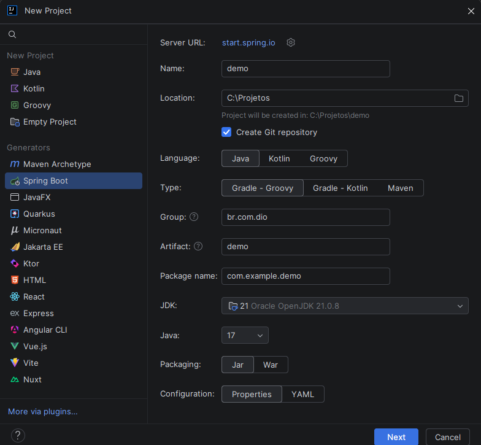

# 🧠 Criando um Projeto Java com IntelliJ IDEA

O IntelliJ IDEA (Ultimate) tem um assistente de criação de projetos integrado, que consome a mesma API do **Spring Initializr** (start.spring.io) direto dentro da IDE.

## Passo a passo

1. Abra o IntelliJ IDEA
2. Clique em **New Project**
3. No menu lateral, em **Generators**, selecione **Spring Boot**
4. Preencha os campos:
   - **Name** → nome do projeto (ex: `demo`)
   - **Location** → pasta onde o projeto será salvo
   - **Create Git repository** → opcional, já inicializa um repositório Git
   - **Language** → Java, Kotlin ou Groovy
   - **Type** → Gradle - Groovy, Gradle - Kotlin ou Maven
   - **Group** → identificador da organização (ex: `br.com.dio`)
   - **Artifact** → nome do projeto/artefato (ex: `demo`)
   - **Package name** → pacote raiz do código-fonte (ex: `com.example.demo`)
   - **JDK** → versão do Java instalada na máquina
   - **Java** → versão da linguagem usada no projeto
   - **Packaging** → Jar ou War
   - **Configuration** → Properties ou YAML
5. Clique em **Next**
6. Selecione a versão do **Spring Boot** e as **dependencies** desejadas (Spring Web, Lombok, DevTools etc.)
7. Clique em **Create**
8. O IntelliJ baixa as dependências e monta a estrutura do projeto automaticamente

> 💡 Repare que os campos são exatamente os mesmos do Spring Initializr — Group, Artifact, Package name, Packaging, Java, Configuration — porque por trás dos panos é a mesma engine.

---
⬅️ [Voltar ao README principal](../README.md)
