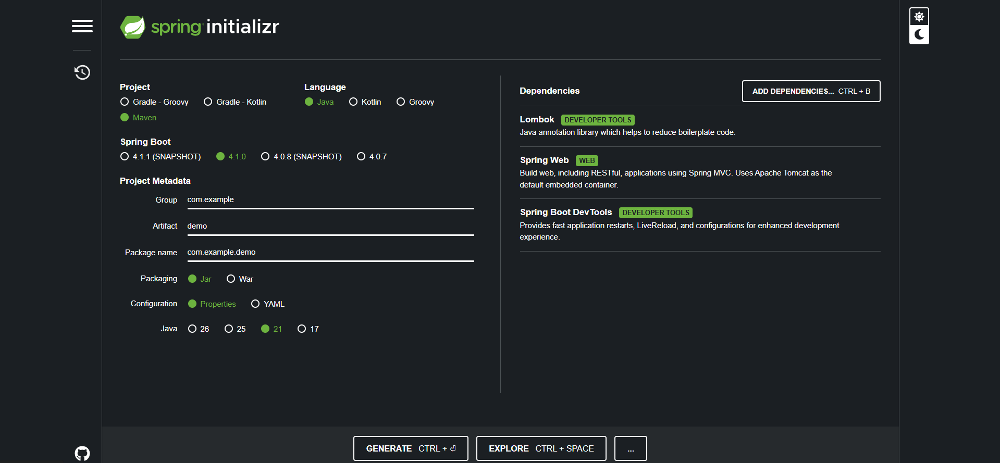

# 🌱 Criando um Projeto Java com Spring Initializr

O [Spring Initializr](https://start.spring.io) é a forma mais simples de gerar a estrutura inicial de um projeto Spring Boot, direto pelo navegador.

## Passo a passo

1. Acesse **start.spring.io**
2. Escolha o **Project** (Maven ou Gradle)
3. Escolha a **Language** (Java, Kotlin ou Groovy)
4. Escolha a versão do **Spring Boot**
5. Preencha o **Project Metadata** (Group, Artifact, Package name, Packaging, Java)
6. Clique em **ADD DEPENDENCIES** e selecione as bibliotecas desejadas
7. Clique em **GENERATE** para baixar o `.zip` do projeto

---

## 📦 Dependências mais comuns

### Lombok
Biblioteca Java que reduz código repetitivo (boilerplate) usando anotações como `@Getter`, `@Setter`, `@Data`, `@Builder`, `@AllArgsConstructor` etc. Ela gera automaticamente, em tempo de compilação, métodos que normalmente seriam escritos manualmente.

### Spring Web
Módulo para construir aplicações web, incluindo APIs REST, usando Spring MVC. Já vem com o **Tomcat** embarcado como servidor padrão, então a aplicação sobe sem precisar instalar um servidor externo.

### Spring Boot DevTools
Ferramenta de produtividade para desenvolvimento. Reinicia a aplicação automaticamente quando o código muda (restart rápido) e habilita **LiveReload** no navegador.

---

## 🔧 Build Tools

### Maven
Ferramenta de build e gerenciador de dependências baseada em XML (`pom.xml`). É mais tradicional, madura e amplamente usada no ecossistema Java.

### Gradle
Ferramenta de build mais moderna e flexível, baseada em scripts Groovy ou Kotlin (`build.gradle` / `build.gradle.kts`). Geralmente é mais rápida que o Maven por usar cache incremental.

---

## 🗣️ Linguagens

### Kotlin
Linguagem moderna, interoperável com Java, que roda na JVM. É mais concisa, tem null-safety nativo e é oficialmente suportada pelo Google para Android. No Spring, é uma alternativa ao Java com sintaxe mais enxuta.

---

## 🌀 Versões do Spring Boot / Snapshots

- Versões numeradas normalmente (ex: `4.1.0`) são **estáveis** e recomendadas para produção.
- Versões marcadas como **SNAPSHOT** (ex: `4.1.1 (SNAPSHOT)`) são builds em desenvolvimento, ainda instáveis, usadas para testar recursos que ainda não foram lançados oficialmente. Não devem ser usadas em produção.

---

## 🏷️ Project Metadata

### Group
Identifica a organização ou empresa dona do projeto, seguindo o padrão de domínio invertido (ex: `com.example`). Funciona como o "namespace raiz" do projeto.

### Artifact
Nome do projeto/aplicação em si (ex: `demo`). É usado para gerar o nome do arquivo final (jar/war) e o nome da pasta do projeto.

### Package Name
Nome completo do pacote Java onde o código-fonte será organizado, geralmente formado pela junção de Group + Artifact (ex: `com.example.demo`).

### Packaging
Formato do arquivo final gerado pelo build:
- **Jar** → aplicação empacotada com servidor embutido, roda sozinha (`java -jar app.jar`). É o padrão para aplicações Spring Boot modernas.
- **War** → formato tradicional para ser implantado em um servidor de aplicação externo (Tomcat, JBoss etc.).

### Configuration
Formato do arquivo de configuração da aplicação:
- **Properties** → arquivo `application.properties`, formato chave=valor, simples e direto.
- **YAML** → arquivo `application.yml`, formato hierárquico (indentado), mais legível para configurações complexas e aninhadas.

---

## ☕ Versões do Java / LTS

O Java segue um ciclo de lançamentos onde nem toda versão é **LTS (Long-Term Support)**:

| Versão | Tipo | Observação |
|---|---|---|
| 17 | LTS | Suporte de longo prazo, muito usada em produção |
| 21 | LTS | Versão LTS mais recente estável, traz Virtual Threads |
| 25 | LTS | Próxima LTS do ciclo |
| 26 | Não-LTS | Versão de curto prazo, focada em novidades e testes |

### Diferença entre as versões

- **Versões LTS** recebem atualizações de segurança e correções por vários anos e são recomendadas para projetos em produção.
- **Versões não-LTS** (releases intermediários, a cada 6 meses) trazem novidades mais rapidamente, mas têm suporte curto (poucos meses), sendo indicadas apenas para testar recursos novos, não para produção.

---
⬅️ [Voltar ao README principal](../README.md)
