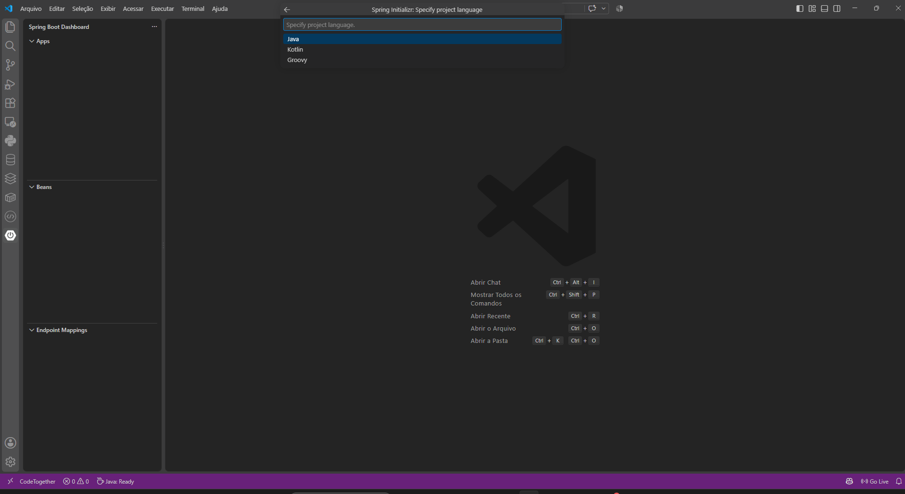

# 💻 Criando um Projeto Java com VS Code

## Pré-requisitos

- Extensão **Extension Pack for Java** (Microsoft)
- Extensão **Spring Boot Extension Pack** (habilita o Spring Boot Dashboard e o assistente do Spring Initializr)
- JDK instalado e configurado

## Passo a passo

1. Abra o VS Code
2. Pressione `Ctrl + Shift + P` para abrir a paleta de comandos
3. Digite e selecione **Spring Initializr: Generate a Maven Project** (ou Gradle)
4. Escolha a **linguagem**: Java, Kotlin ou Groovy (como na imagem acima)
5. Escolha a versão do **Spring Boot**
6. Informe o **Group Id** (ex: `com.example`)
7. Informe o **Artifact Id** (ex: `demo`)
8. Escolha a versão do **Java**
9. Escolha o **Packaging** (Jar ou War)
10. Selecione as **dependencies** desejadas (Spring Web, Lombok, DevTools etc.) e confirme com Enter
11. Escolha a pasta onde o projeto será salvo
12. O VS Code gera o projeto e pergunta se deseja abri-lo na janela atual ou em uma nova

> 💡 O painel **Spring Boot Dashboard**, visível na lateral esquerda, permite rodar, parar e monitorar a aplicação (Beans, Endpoint Mappings) sem precisar usar o terminal.

---
⬅️ [Voltar ao README principal](../README.md)
