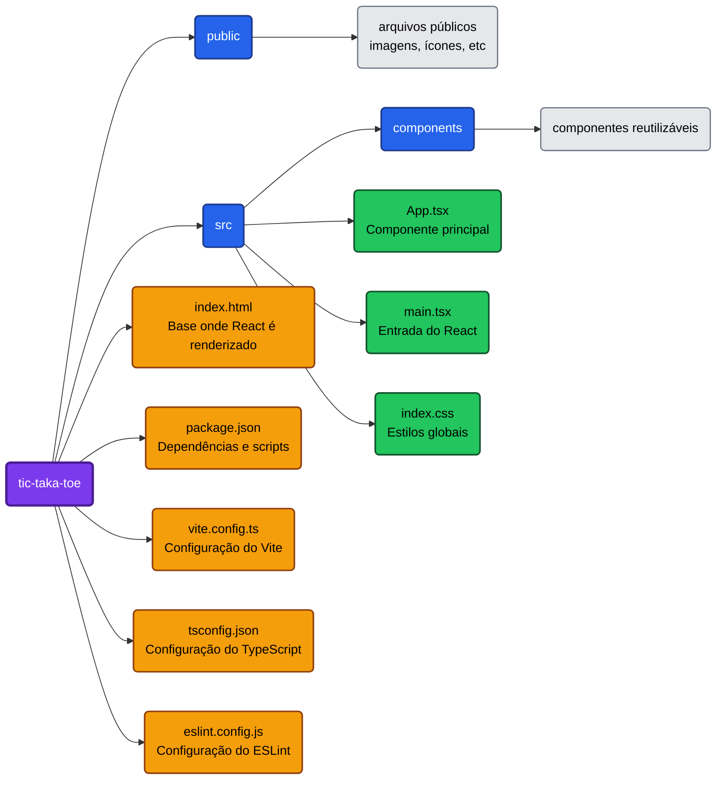

# 📁 Estrutura do Projeto

```mermaid
graph LR
A(tic-taka-toe)
A --> B(public)
B --> B1(arquivos públicos<br/>imagens, ícones, etc)
A --> C(src)
C --> D(components)
D --> D1(componentes reutilizáveis)
C --> E(App.tsx<br/>Componente principal)
C --> F(main.tsx<br/>Entrada do React)
C --> G(index.css<br/>Estilos globais)
A --> H(index.html<br/>Base onde React é renderizado)
A --> I(package.json<br/>Dependências e scripts)
A --> J(vite.config.ts<br/>Configuração do Vite)
A --> K(tsconfig.json<br/>Configuração do TypeScript)
A --> L(eslint.config.js<br/>Configuração do ESLint)
classDef root fill:#7c3aed,color:#fff,stroke:#4c1d95,stroke-width:3px;
classDef folder fill:#2563eb,color:#fff,stroke:#1e3a8a,stroke-width:2px;
classDef react fill:#22c55e,color:#000,stroke:#14532d,stroke-width:2px;
classDef config fill:#f59e0b,color:#000,stroke:#92400e,stroke-width:2px;
classDef file fill:#e5e7eb,color:#000,stroke:#6b7280,stroke-width:1.5px;
class A root
class B,C,D folder
class E,F,G react
class H,I,J,K,L config
class B1,D1 file
```

---
⬅️ [Voltar ao README principal](../README.md)
